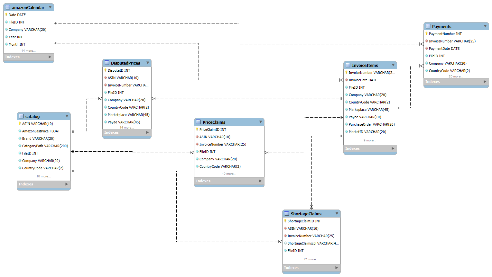
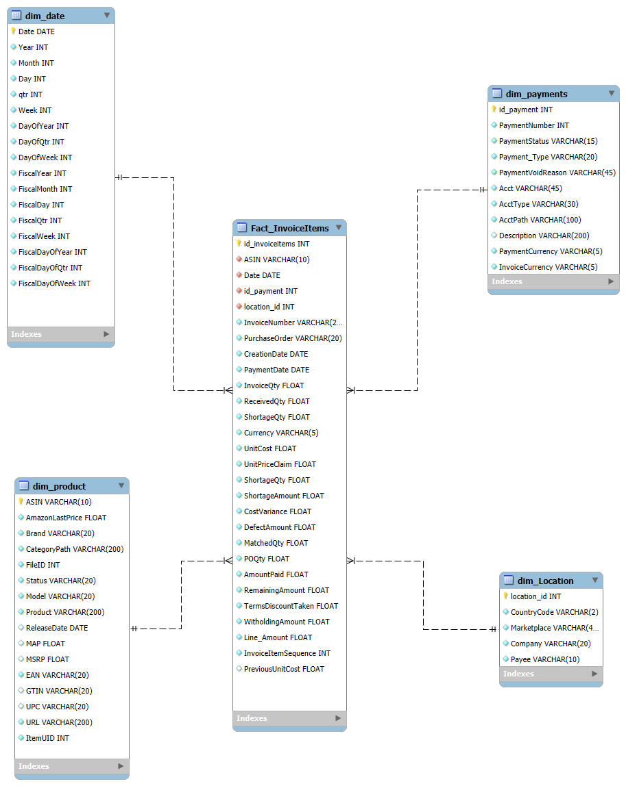
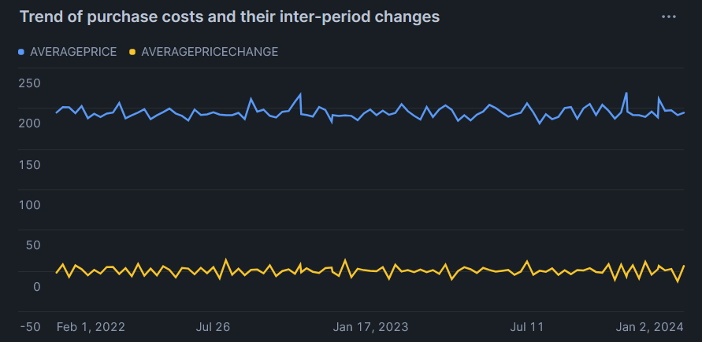
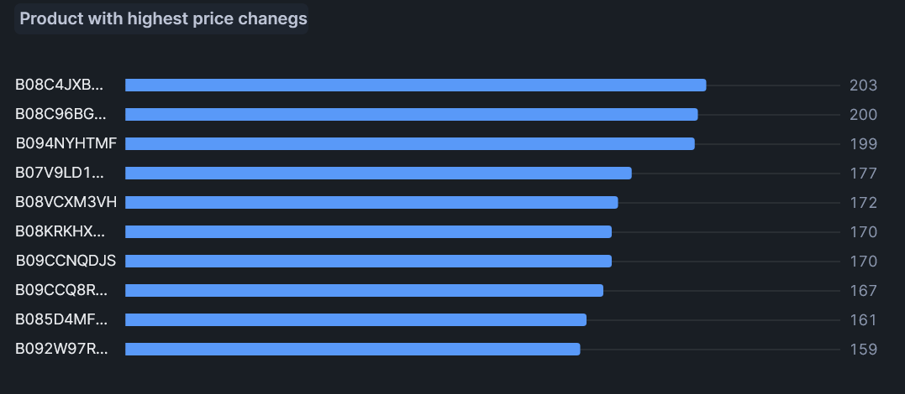
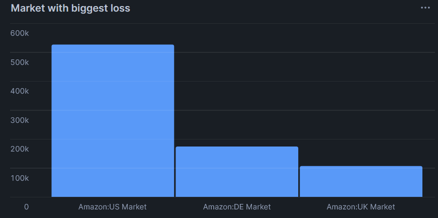
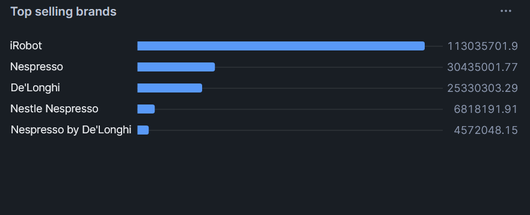
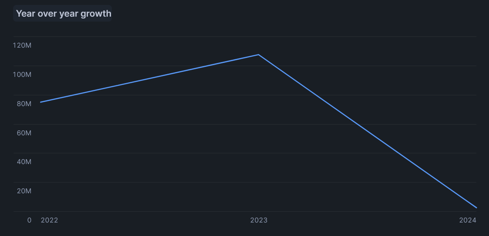
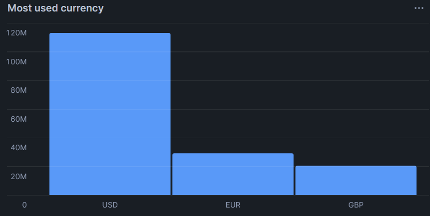

# ELT - Amazon Vendor Analysis
Tento projekt je zameraný na analýzu dodavateľských dát od Amazonu (Vendor Order-To-Cash). Cieľom projektu je spracovať dáta o fakturáciách, platbách a reklamáciách do funkčného dimenzionálneho modelu typu Star Schema, ktorý umožňuje efektívnu analýzu finančnej výkonnosti.

## 1. Úvod a popis zdrojových dát
Dataset pochádza zo Snowflake Marketplace od poskytovateľa Merchant AI. Obsahuje vzorku dát Amazon Vendor Cash-To-Cash, ktoré simulujú reálny biznis proces spoločnosti Amazon. Tento dataset som si vybrala, lebo vyhovuje požiadavkam projektu a ukazuje ako funguje veľký obchod medzi dodavateľom a Amazonom. Celý proces beží na tom, že sa pošle tovar do skladu Amazonu a následne je pripravená faktúra, v ktorej sa riešia prípadné problémy a proces končí zaplatením danej sumy.

Analyzujú sa kľúčové aspekty:
* **Finančná výkonnosť** - sledovanie celkového objemu fakturácie a reálne prijatých platieb
* **Cenové výkivy** - identifikácia trendov v nákupných cenách a frekvencie ich zmien
* **Logistické straty** - kvantifikácia chýbajúceho tovaru a reklamácii na jednotlivých trhoch
* **Produktová hierarchia** - analýza predajov podľa značiek a ketegórií produktov

Zdrojové dáta pochádzajú z datasetu AMAZON_VENDOR_ORDER_TO_CASH__SAMPLE, ktorá obsahuje sedem hlavných tabuliek.
* **InvoiceItems** - obsahuje detailné riadky faktúr ako množstvo cien a informácie o objednávkach
* **Catalog**  - informácie o produktoch (značky, kategórie, ASIN)
* **AmazonCalendar** - časové údaje pre Amazon obdobia
* **Payments** - informácie o úhradách faktúr
* **PriceClaims** - reklamácie súvisiace s cenovými rozdielmi
* **ShortageClaims** - záznamy o chýbajúcom tovare pri dodávkach
* **DisputedPrices** - informácie o cenových sporoch (tabuľka neobsahovala žiadne dáta, preto sa s ňou ďalej nepracovalo)

Tieto sú následne extrahované, transformované a integrovanej do Star schémy, z ktorej sa môže urobiť analytická interpretácia.

### 1.1 Dátová architektúra
**ERD Diagram**



## 2. Dimenzionálny model
Použitý bol dimenzionálny model typu Star Schema, ktorý je výhodný pre rýchle dopyty. Na diagrame je možné vidieť štruktúru prepojenia faktovej tabuľky s dimenzionálnymi.


**Dimenzie:**
* **dim_product** - obsahuje informácie o produktoch (Brand, Category), typ SCD 0 - statické údaje.
* **dim_date** - kalendárne a fiškálne údaje, typ SCD 0 - statické údaje
* **dim_location** - geografické rozdelenie podľa Marketplace a krajiny, typ SCD 0 - statické údaje
* **dim_payments** - detaily o platobných metódach a statuse, typ SCD 1 - prepísanie pri zmene statusu platby
  
**Fakty:**
* **fact_invoice_items** - centrálna tabuľka tvorica informácie o faktúrach s pridaním údajov o reklamáciách a platbách
  * Hlavný kľúč: id_invoiceitems
  * Cudzie kľúče:
    *   ASIN - prepojenie s tabuľkou produktov
    *   Date - prepojenie s kalendárom
    *   location_id - prepojenie s tabuľkou lokalít
    *   id_payment - prepojenie s tabuľkou platieb
  * Metriky: Line_Amount(obrat), ShorategeAmount(strata), CostVariance...
  * Windows funkcie:
    * InvoiceItemsSequence(row_number()) - sekvencia položiek vo faktúre
    * PreviousUnitCost(lag()) - predchádzajúca cena pre analýzu cenových zmien

## 3. ELT proces
ELT proces má tri fázy - extrahovanie, načítanie a transformácia. Následne je popísaný ich postup v prostredí Snowflake.

### Extract
Dáta boli získané zo Snowflake Marketplace z datasetu Merchant AI: Amazon Vendor Order-to-Cash. Zdrojová databáza je AMAZON_VENDOR_ORDER_TO_CASH__SAMPLE a schéma PUBLIC. Prvým krokom bolo vytvorenie staging tabuliek, ktoré slúžia ako kópia dát, ktoré následne možno ďalej spracovať.

**Vzorový kód:**
```
create or replace table stg_invoice_items as
select * from AMAZON_VENDOR_ORDER_TO_CASH__SAMPLE.PUBLIC."InvoiceItems";
```
Ostatné staging tabuľky boli vytvorené rovnakým spôsobom.

### Load
Fáza Load zahŕňa naplnenie dimenzií a tabuľky faktov, ktoré budú tvoriť Star schému, z ktorej možno následne robiť jednoduchú analýzu. Použitá bola priama metóda nahrávania, kde sa prepojenia medzi faktami a dimenziami vytvárajú počas procesu nahrávania.

Z nasledujúcich staging tabuliek boli nahrané dáta do dimenzií a faktovej tabuľky.
* stg_catalog -> dim_product
* stg_calendar -> dim_date
* stg_invoice_items a stg_payments -> dim_location a dim_payments
* stg_invoice_items a ostatné staging tabuľky -> fact_invoice_items

Ako validácia dát bolo urobená kontrola, či počet riadkov stg_invoice_items a fact_invoice_items sa zhoduje, skontrolovalo sa či dodatočné výpočty majú správny výsledok a tiež či sa dáta preniesli správne. Pomocou jednoduchého *select* príkazu sa všetko skontrolovalo.
```
select
    (select count(*) from stg_invoice_items)  as staging_count,
    (select count(*) from fact_invoice_items) as fact_count;
```
### Transform
V tejto fáze dochádza k premene surových dát v staging na informácie s pridanou hodnotou. Tiež to dojde k očiste dát ako odstránenie duplicít a nepotrebných polí, zabezpečenie správnych dátových typov a pridanie nových metrík.

**dim_product** je dimenzia, ktorá spája technické parametre produktov s ich biznis údajmi ako značka a kategória. Bola naplnená použitím staging tabuľky stg_catalog. Dôležitým krokom pri tejto tabuľke bolo generovanie primárneho kľúča cez funkciu *row_number()*, ktorá bola nazvaná id_product. Vďaka tomu má každý produkt svoje unikátne ID, čo uľahčuje spájanie s ostatnými tabuľkami a zabezpečuje poriadok v modeli. Dimenzia je navrhnutá ako SCD Typ 0. Vychádza sa z predpokladu, že základné atribúty produktu, ako sú EAN alebo dátum vydania, sú nemenné. Ak by sa v systéme zmenila cena, berie sa ako aktuálna hodnota bez toho, aby sa sledovala jej stará históriu v tejto tabuľke. Cez vnútorný dopyt boli vybrané len tie stĺpce, ktoré sú naozaj dôležité, aby tabuľka nebola neprehľadná.
```
create or replace table dim_product as(
select
row_number() over (order by ASIN, "Product") as id_product,
ASIN,
"Product" as Product,
"Brand" as Brand,
"CategoryPath" as CategoryPath,
"Model" as Model,
"ReleaseDate" as ReleaseDate,
"MAP",
UPC,
EAN,
GTIN,
"AmazonLastPrice" as AmazonLastPrice,
MSRP,
URL,
"ItemUID" as ItemUID,
"Status" as Status
from (select ASIN,"Product","Brand","CategoryPath","Model",UPC,EAN,GTIN,"AmazonLastPrice",MSRP,"Status","ReleaseDate","ItemUID","MAP",URL from stg_catalog)
);
```

**dim_location** je dimenzia, ktorá slúži na rozdelenie faktúr podľa toho, kde vznikli. Dáta boli extrahované zo staging tabuľky faktúr stg_invoice_items. Hlavným cieľom bolo vyčistiť opakujúce sa údaje, keďže pôvodná tabuľka mala informáciu o krajine v každom jednom riadku faktúry. Použil sa select distinct, aby sa vytvoril len zoznam unikátnych trhovísk a krajín. Pomocou funkcie *row_number()* sa priradil technický kľúč location_id, ktorý tabuľku prepája s faktami. Z hľadiska zmien ide o SCD Typ 0, pretože sa počíta s tým, že priradenie trhovísk ku krajinám sa meniť nebude.
```
create or replace table dim_location as(
select distinct
row_number() OVER (order by "CountryCode", "Marketplace") as location_id,
"CountryCode" as CountryCode,
"Marketplace" as Marketplace,
"Company" as Company,
"Payee" as Payee
from (select distinct "CountryCode","Marketplace","Company","Payee" from stg_invoice_items)
);
```

**dim_payments** je dimenzia, ktorá poskytuje detailný pohľad na to, ako sú na tom peniaze a v akom stave sú platby. Transformácia využíva dáta zo stg_payments. Návrh sa zameriava na to, aby v tabuľke neboli duplicity v číslach platieb, čo sa vyriešilo cez *select distinct*. Dimenzia je typu SCD Typ 1 – toto riešenie bolo zvolené, pretože ak sa status platby zmení, pôvodná hodnota sa jednoducho prepíše. Takto vždy aktuálny stav bez zbytočnej histórie.
```
create or replace table dim_payments as(
select
row_number() over (order by "PaymentNumber", "AcctType") as payment_id,
"PaymentNumber" as PaymentNumber,
"PaymentStatus" as PaymentStatus,
"PaymentType" as PaymentType,
"PaymentVoidedReason" as PaymentVoidedReason,
"Acct" as Acct,
"AcctType" as AcctType,
"AcctPath" as AcctPath,
"Description" as Description,
"PaymentCurrency" as PaymentCurrency,
"InvoiceCurrency" as InvoiceCurrency,
"InvoiceNumber" as InvoiceNumber
from (select distinct "PaymentNumber","PaymentStatus","PaymentType","PaymentVoidedReason","Description","PaymentCurrency", "Acct", "AcctType", "AcctPath", "InvoiceCurrency", "InvoiceNumber" from stg_payments)
);
```

**dim_date** je dimenzia, ktorá funguje ako kalendár celého modelu a je dôležitá na to, aby sa vedeli sledovať predaje alebo reklamácie v čase. Čerpá dáta zo staging tabuľky stg_calendar, ktorá obsahuje informácie o dňoch, mesiacoch a rokoch. Bol použitý príkaz *select distinct*, aby bol v tabuľke pre každý kalendárny deň len jeden riadok, vďaka tomu sa vyhne duplicitám pri spájaní s hlavnou tabuľkou faktov. Táto dimenzia je nastavená ako SCD Typ 0, pretože údaje o dátumoch sú statické a nepredpokladá sa, že by sa niekedy zmenili.
```
create or replace table dim_date as(
select distinct
"Date" as Date,
"Year" as Year,
"Month" as Month,
"Day" as Day,
"Qtr" as Qtr,
"Week" as Week,
"DayofYear" as DayofYear,
"DayofWeek" as DayofWeek,
"DayofQtr" as DayofQtr,
"FiscalYear" as FiscalYear,
"FiscalMonth" as FiscalMonth,
"FiscalDay" as FiscalDay,
"FiscalQtr" as FiscalQtr, 
"FiscalWeek" as FiscalWeek,
"FiscalDayofYear" as FiscalDayofYear,
"FiscalDayofWeek" as FiscalDayofWeek,
"FiscalDayofQtr" as FiscalDayofQtr
from stg_calendar
);
```

**fact_invoice_items** je faktová tabuľka a predstavuje centrálnu časť celej Star schémy. Jej vytvorenie bolo najnáročnejšou fázou ELT procesu, pretože vyžadovalo integráciu dát zo siedmich rôznych zdrojov. Základom tabuľky sú transakčné dáta o riadkoch faktúr zo stg_invoice_items. Avšak na získanie pohľadu na každú transakciu, bolo nutné k týmto dátam pripojiť informácie z ostatných častí biznis procesu pomocou viacerých *left join* operácií:
   * Prepojenie na dimenzie: Faktúry sú prepojené s produktmi, dátumami, miestami a platbami cez ich technické kľúče.
   * Zahrnutie reklamácií: Keďže k jednej položke môže byť viac reklamácií, muselo sa ich v poddopytoch sčítať pomocou *sum()*. Tým sa zabezpečilo, že sa vo faktovej tabuľke uvidí celková strata, ale riadky faktúry sa v tabuľke                   nezduplikujú.
   * Finančné vyrovnanie: Podobným spôsobom sa integrovali dáta o reálne prijatých platbách, čo umožňuje priame porovnanie fakturovanej sumy s cash-flow.
     
Podľa požiadaviek zadania boli do faktovej tabuľky implementované analytické funkcie, ktoré pridávajú modelu dynamický charakter:
  * ROW_NUMBER(): Bol použitý na vytvorenie unikátneho ID pre každý riadok a tiež na očíslovanie položiek v rámci jednej faktúry.
  * LAG(): je veľmi užitočná, lebo v každom riadku ukáže nákupnú cenu produktu z predchádzajúcej faktúry, vďaka čomu sa môže sledovať, či cena stúpla alebo klesla.
    
Priamo pri nahrávaní sa vypočíta metrika Line_Amount, čo je množstvo vynásobené cenou. Tento výpočet výrazne zrýchlil tvorbu grafov a zabezpečil, že výsledky budú v vždy rovnaké.
```
create or replace table fact_invoice_items as(
select
row_number() over (order by i."InvoiceDate", i."InvoiceNumber") as id_invoiceitems,
dp.id_product,
dd.DATE as Date,  
pm.id_payment, 
dloc.location_id as id_location,
i."InvoiceNumber",
i."PurchaseOrder",
i."CreationDate",
i."PaymentDate",
i."ReceivedASINs" as ASIN,
i."InvoiceQty",
i."ReceivedQty",
i."ShortageQty",
i."UnitCost",
(i."InvoiceQty" * i."UnitCost") as Line_Amount,
i."Currency",

sc.ShortageAmount,
pc.CostVariance,
pc.DefectAmount,
pc.MatchedQty,
pc.POQty,
pc.UnitPriceClaim,

pay.AmountPaid,
pay.RemainingAmount,
pay.TermsDiscountTaken,
pay.WithholdingAmount,

row_number() over (partition by i."InvoiceNumber" order by i."ReceivedASINs") as InvoiceItemSequence,
lag(i."UnitCost") over (partition by i."ReceivedASINs" order by i."InvoiceDate") as PreviousUnitCost


from stg_invoice_items i
left join (select distinct DATE from dim_date) dd on i."InvoiceDate" = dd.DATE 
    
left join (select "Marketplace", "CountryCode", MAX(location_id) as location_id
           from dim_location
           group by 1, 2) 
           dloc on i."Marketplace" = dloc."Marketplace" and i."CountryCode" = dloc."CountryCode"

left join (select "InvoiceNumber" as JOIN_KEY, 
           SUM("AmountPaid") as AmountPaid, 
           MAX("RemainingAmount") as RemainingAmount, 
           SUM("TermsDiscountTaken") as TermsDiscountTaken, 
           SUM("WithholdingAmount") as WithholdingAmount
           from stg_payments 
           group by 1)
           pay on i."InvoiceNumber" = pay.JOIN_KEY

left join(select "InvoiceNumber" as JOIN_KEY, "ASIN" as ASIN_KEY, SUM("ShortageAmount") as ShortageAmount
          from stg_shortage_claims 
          group by 1, 2) 
          sc on i."InvoiceNumber" = sc.JOIN_KEY and i."ReceivedASINs" = sc.ASIN_KEY

left join(select "InvoiceNumber" as JOIN_KEY, "ASIN" as ASIN_KEY, 
          SUM("CostVariance") as CostVariance, 
          SUM("DefectAmount") as DefectAmount, 
          SUM("MatchedQty") as MatchedQty, 
          MAX("POQty") as POQty, 
          MAX("POUnitPrice") as UnitPriceClaim
          from stg_price_claims 
          group by 1, 2) 
          pc on i."InvoiceNumber" = pc.JOIN_KEY and i."ReceivedASINs" = pc.ASIN_KEY

left join (select InvoiceNumber as JOIN_KEY, MAX(payment_id) as id_payment
           from dim_payments
           group by 1) 
           pm ON i."InvoiceNumber" = pm.JOIN_KEY

left join (select "ASIN" as ASIN_KEY, MAX(id_product) as id_product
           from dim_product
           group by 1) 
           dp ON i."ReceivedASINs" = dp.ASIN_KEY);
```
## 4. Vizualizácia dát
V Dashboarde sa tu z tabuliek pripravili grafy, z ktorých môžeme analyzovať dáta.
1[dashboard](img/dashboard.png)

### 1. Vývoj nákupných cien v čase



Tento graf odpovedá na otázku, či sa nakupuje tovar stále za rovnakú cenu, alebo sa ceny menia. Využil sa tu výpočet, ktorý porovnáva aktuálnu cenu s tou predchádzajúcou.
```
select 
d.Date,
avg(f."UnitCost") as AveragePrice,
avg(f."UnitCost" - f.PreviousUnitCost) as AveragePriceChange
from fact_invoice_items f
join dim_date d on d.Date=f.Date
where f.PreviousUnitCost is not null
group by d.Date
order by d.Date;
```
Modrá čiara ukazuje priemernú cenu tovaru. Vidno, že sa drží v celku stabilne okolo jednej úrovne. Žltá čiara ukazuje samotné zmeny, ak by niekedy prudko vyskočila hore, znamenalo by to, že dodávateľ zrazu výrazne zdražil tovar. Keďže je línia relatívne plochá, ceny sú predvídateľné.

### 2. Produkty s najčastejšou zmenou ceny



Tento graf ukazuje konkrétne produkty (ASIN), ktoré majú najpohyblivejšiu cenu.
```
select 
ASIN,
count(*) as ChangeCount,
from fact_invoice_items
where "UnitCost"!=PreviousUnitCost
group by asin
order by asin desc
limit 10;
```

Graf ukazuje 10 produktov, ktoré najčastejšie menia svoju nákupnú cenu. Napríklad produkt na prvom mieste zmenil cenu viac ako 200-krát. Pre firmu je to signál, že pri týchto položkách neexistuje stabilná dohoda o cene a kupca by sa mal pokúsiť vyjednať pevnejšie podmienky.

### 3. Straty podľa trhov



Tento graf sleduje Shortage Claims, teda situácie, kedy sa tovar zaplatili, ale reálne neprišiel alebo chýbal v sklade.
```
select
l."Marketplace",
sum(f.ShortageAmount) as TotalShortageValue
from fact_invoice_items f
join dim_location l on f.id_location=l.location_id
where f.ShortageAmount > 0
group by l."Marketplace"
order by TotalShortageValue desc;
```

Najväčší stĺpec vidíme pri trhu v USA. Znamená to, že tam dochádza k najväčším stratám kvôli chýbajúcemu tovaru, viac ako 500-tisíc. Nemecko a Británia sú na tom oveľa lepšie. Je to dôkaz, že logistika v USA potrebuje lepšiu kontrolu.

### 4. Najlepšie zarábajúce značky



Tu vidieť, ktoré značky prinášajú najviac peňazí z predaja.
```
select
p.Brand,
SUM(f.Line_Amount) as TotalSalesValue
from fact_invoice_items f
join dim_product p on f.id_product=p.id_product
group by p.Brand
order by TotalSalesValue desc
limit 5;
```
Značka iRobot je výrazne najlepšia a tvorí hlavnú časť príjmov, vyše 113 miliónov. Ostatné značky ako Nespresso sú úspešné, ale v porovnaní s iRobotom sú oveľa menšie. Táto značka je kľúčová, ak by sa s ňou skončila spolupráca, prišlo by sa o väčšinu tržieb.

### 5. Celkový objem faktúr po rokoch



Tento graf ukazuje jednoduchý pohľad na to, či firma rastie alebo klesá.
```
select
d.year,
sum(f.Line_Amount) as Total_Invoiced
from fact_invoice_items f
join dim_date d on d.date=f.date
group by d.year
order by d.year;
```

Vidíme pekný rast medzi rokmi 2022 a 2023, kedy sa tržby dostali na maximum. Rok 2024 vyzerá ako veľký pád, ale je to pravdepodobne len tým, že rok 2024 ešte neskončil a v datasete nie sú nahrané všetky dáta za celý rok. Celkovo firma do konca roka 2023 úspešne rástla.

### 6. Rozdelenie mien platieb



```
select 
p.PaymentCurrency,
sum(f.Line_Amount) as CelkovaSuma
from fact_invoice_items f
join dim_payments p on f.id_payment = p.payment_id
group by p.PaymentCurrency
order by CelkovaSuma desc;
```
Tento graf dáva prehľad o závislosti od jednotlivých svetových mien. Najväčší stĺpec je USD, čo znamená, že väčšina obchodov prebieha v dolároch. Je to dôležitá informácia, pretože ak by dolár náhle oslabol, zisky po prepočte na inú menu by mohli klesnúť. Graf teda pomáha sledovať, kde je najväčšiu finančná sila a kde sa treba mať na pozore pred zmenami kurzov.


**Autor:** Arlett Borvák
